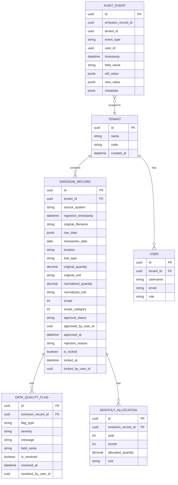

# MODEL.md — Data Model Design

## Overview

The Breathe ESG data model is built around a single flat `EmissionRecord` table that stores
normalized activity data from three heterogeneous source systems (SAP, Utility, Concur Travel),
with supporting tables for multi-tenant isolation, data quality flags, audit events, and
billing period allocations.

---

## Entity-Relationship Diagram



Note: `AUDIT_EVENT.emission_record_id` and `AUDIT_EVENT.tenant_id` are plain UUID columns,
not foreign keys. This is intentional — see the AuditEvent section below.

---

## Design Decisions

### Why JSONB for `raw_data`

Every `EmissionRecord` stores the original source payload in a `raw_data` JSONB column.

**Rationale:**

- **Audit lineage.** Auditors need to verify that the normalized values faithfully represent
  the source data. Storing the raw payload alongside the normalized record makes this
  comparison trivial without needing to re-fetch the original file.

- **Schema heterogeneity.** The three source systems have completely different shapes:
  SAP produces tab-separated rows with fields like `EBELN`, `EBELP`, `BEDAT`; utility CSVs
  have `account_number`, `billing_period_start`, `consumption_kwh`; Concur JSON has nested
  `expense_reports → entries` arrays. A single typed column cannot accommodate all three.
  JSONB stores each source's native structure without forcing a lowest-common-denominator schema.

- **Forward compatibility.** If a new source system is added, or an existing source adds
  new fields, the `raw_data` column captures them automatically without a migration.

- **PostgreSQL JSONB is queryable.** Unlike a text blob, JSONB supports indexed path queries
  (`raw_data->>'EBELN'`), which means the raw data can be searched if needed.

The tradeoff is that `raw_data` is not normalized and cannot be joined or aggregated directly.
This is acceptable because `raw_data` is read-only reference data — all analytical queries
operate on the typed columns.

---

### Why a Separate `MonthlyAllocation` Table

Utility billing periods do not align with calendar months. A bill from MSEDCL might cover
4 January to 3 February, spanning two months. For monthly GHG reporting, the consumption
must be split proportionally across those months.

Two alternatives were considered:

| Option | Description | Problem |
|--------|-------------|---------|
| Store allocations as JSONB on `EmissionRecord` | `monthly_allocations: [{year: 2024, month: 1, kwh: 120}, ...]` | Not queryable by month; aggregation requires application-level unpacking |
| Separate `MonthlyAllocation` table | One row per (record, year, month) | Slightly more storage; clean SQL aggregation |

The separate table was chosen because:

- Monthly totals can be computed with a simple `GROUP BY year, month` SQL query.
- The `unique_together` constraint on `(emission_record, year, month)` prevents duplicate
  allocations at the database level.
- The relationship is a true one-to-many (one billing record → many monthly slices), which
  maps naturally to a relational table.

---

### Multi-Tenant Isolation via TenantManager + `tenant_id` FK

Every data-bearing table (`EmissionRecord`, `DataQualityFlag`, `MonthlyAllocation`) carries
a `tenant_id` foreign key to the `Tenant` table. Isolation is enforced at two levels:

**1. Application-level: `TenantManager`**

All models use `TenantManager` as their default Django manager. When a request is being
processed, `TenantMiddleware` reads the authenticated user's `tenant_id` and stores it in
a thread-local variable via `set_current_tenant()`. `TenantManager.get_queryset()` reads
this thread-local and automatically appends `.filter(tenant_id=current_tenant)` to every
ORM query.

This means a developer cannot accidentally return cross-tenant data by forgetting a filter —
the manager handles it transparently.

```python
# This automatically returns only records for the current request's tenant:
EmissionRecord.objects.filter(scope=1)

# Explicit scoping is also available for service-layer code:
EmissionRecord.objects.for_tenant(tenant_id).filter(scope=1)
```

**2. Database-level: indexes**

Composite indexes on `(tenant_id, source_system)` and `(tenant_id, transaction_date)` ensure
that tenant-scoped queries are efficient even as the table grows across many tenants.

**Why not PostgreSQL Row-Level Security (RLS)?**

PostgreSQL RLS was considered but not implemented for this prototype. RLS requires setting
a session variable (`SET app.current_tenant = '...'`) on every database connection, which
adds complexity to connection pooling and migration scripts. The application-level
`TenantManager` approach achieves the same isolation guarantee with simpler operational
overhead. A production system handling highly sensitive data should add RLS as a second
layer of defence.

---

### Why `AuditEvent` Stores `tenant_id` Directly (Not as a FK)

`AuditEvent` stores `emission_record_id` and `tenant_id` as plain UUID columns rather than
foreign keys.

**Reason: audit trail must survive record deletion.**

If `emission_record_id` were a foreign key with `ON DELETE CASCADE`, deleting an
`EmissionRecord` would silently delete its audit history — defeating the purpose of the
audit trail. If it were `ON DELETE RESTRICT`, records could never be deleted as long as
audit events exist.

Storing the UUID directly means:
- The audit trail is preserved even after the emission record is deleted.
- `tenant_id` is stored redundantly on the event so that tenant-scoped audit queries
  remain efficient without needing to join back to a (potentially deleted) record.
- The `AuditEvent.save()` method raises `ValueError` if called on an existing instance,
  enforcing append-only immutability at the application layer.
- The `AuditEvent.delete()` method raises `ValueError` unconditionally, preventing
  programmatic deletion.

---

### Single-Table Inheritance for Source-Specific Fields

Rather than using Django's multi-table inheritance (separate `SAPEmissionRecord`,
`UtilityEmissionRecord`, `TravelEmissionRecord` tables), all source-specific fields are
stored on the single `EmissionRecord` table with `blank=True, default=""` or `null=True`.

**Rationale:**

- **Simpler queries.** A single table means no joins when listing records from multiple
  sources. The analyst dashboard's main grid query is a single `SELECT` with filters.

- **Consistent audit trail.** All records share the same primary key space and the same
  `AuditEvent` foreign key, regardless of source.

- **Acceptable sparsity.** SAP-specific fields (`ebeln`, `ebelp`, `werks`, etc.) are null
  for utility and travel records, and vice versa. PostgreSQL stores null columns efficiently,
  so the storage overhead is minimal.

The tradeoff is that the table has many nullable columns. This is mitigated by clear field
groupings in the model code and source-specific serializers that only expose relevant fields.

---

### UUID Primary Keys

All models use `uuid.uuid4` as the primary key rather than auto-incrementing integers.

**Rationale:**

- UUIDs are safe to generate client-side or in the ingestion engine without a database
  round-trip, which simplifies bulk insert logic.
- UUIDs do not leak record counts or insertion order to API consumers.
- UUIDs are globally unique across tenants, which simplifies audit trail queries that
  reference records by ID without a tenant qualifier.
